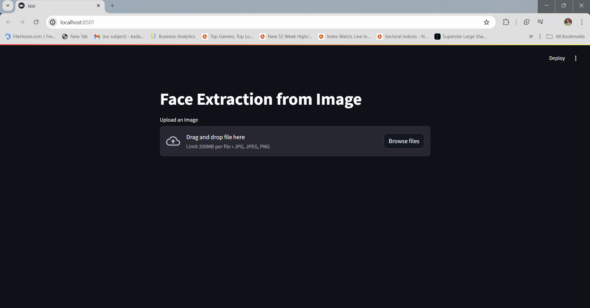
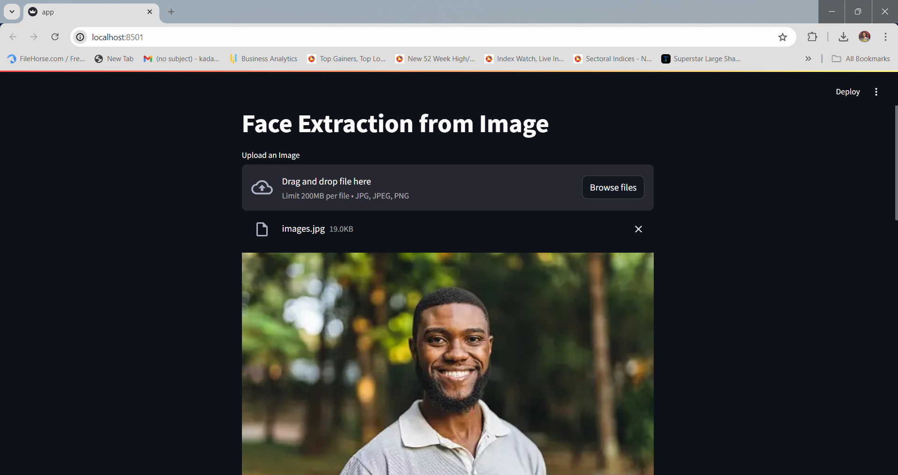

# Face Extraction

This project is designed using Streamlit, Deep Learning and Computer Vision techniques where users can upload an image. After processing, the application extracts the face from the image, providing it with a transparent background.

## Demo


## Screenshots





## How to run?

### Step 1 - Clone the repository

```bash
https://github.com/imroh17kadam/face-extraction
```

### Step 2 - Checkout to branch
```bash
# master is the main branch
git checkout master
```

### Step 3 - Create a virtual environment after opening the repository

#### Using Conda

```bash
conda create -n extraction python=3.9 -y
```

```bash
conda activate extraction
```

#### Using Python

```bash
python3.9 -m venv extraction
```

```bash
.\extraction\Scripts\activate
```

### Step 4 - Install the requirements
```bash
pip install -r requirements.txt
```

### Step 5 - Run the Application
```bash
# Finally run the following command
streamlit run app.py
```
