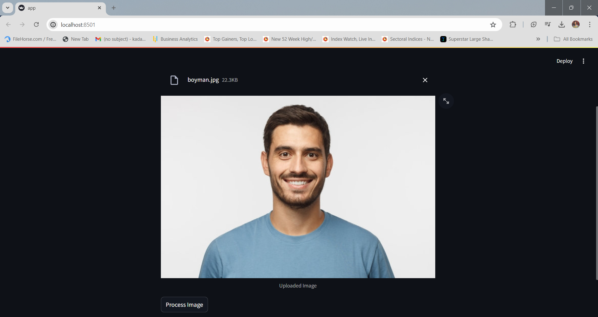

# Face Extraction

This project is designed using Streamlit where users can upload an image. After processing, the application extracts the face from the image, providing it with a transparent background.

## Demo


## Screenshots





# How to run?
### Steps:

Clone the repository

```bash
https://github.com/imroh17kadam/face-extraction
```

### Step 1 - Checkout to branch
```bash
# master is the main branch
git checkout master
```

### Step 2 - Create a virtual environment after opening the repository
#### Using Conda

```bash
conda create -n extraction python=3.9 -y
```

```bash
conda activate extraction
```

#### Using Python

```bash
python3.9 -m venv extraction
```

```bash
.\extraction\Scripts\activate
```

### Step 3 - Install the requirements
```bash
pip install -r requirements.txt
```

### Step 4 - Run the Application
```bash
# Finally run the following command
streamlit run app.py
```